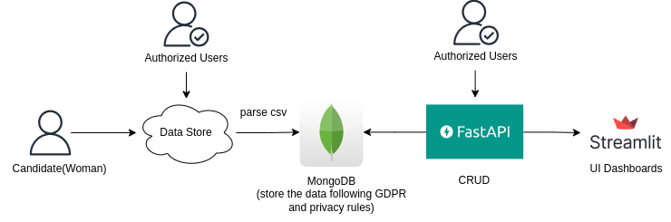

<!-- Improved compatibility of back to top link: See: https://github.com/othneildrew/Best-README-Template/pull/73 -->
<a id="readme-top"></a>
<!--
*** Thanks for checking out the Best-README-Template. If you have a suggestion
*** that would make this better, please fork the repo and create a pull request
*** or simply open an issue with the tag "enhancement".
*** Don't forget to give the project a star!
*** Thanks again! Now go create something AMAZING! :D
-->


<!-- PROJECT LOGO -->
<br />
<div align="center">
  <!-- <a>
    
  </a> -->

<h3 align="center">Menstrual Metrics Data Management App</h3>

  <p align="center">
    February 2025
    <br />
    <a href="https://github.com/konsymeonidou/cbmr-project"><strong>Explore the docs »</strong></a>
    <br />
    <br />
    <!-- <a href="https://github.com/github_username/repo_name">View Demo</a>
    ·
    <a href="https://github.com/github_username/repo_name/issues/new?labels=bug&template=bug-report---.md">Report Bug</a>
    ·
    <a href="https://github.com/github_username/repo_name/issues/new?labels=enhancement&template=feature-request---.md">Request Feature</a> -->
  </p>
</div>


<!-- TABLE OF CONTENTS -->
<details>
  <summary>Table of Contents</summary>
  <ol>
    <li>
      <a href="#about-the-project">About The Project</a>
      <ul>
        <li><a href="#built-with">Built With</a></li>
      </ul>
    </li>
    <li>
      <a href="#getting-started">Getting Started</a>
      <ul>
        <li><a href="#prerequisites">Libraries</a></li>
      </ul>
    </li>
    <li><a href="#usage">Usage</a></li>
    <li><a href="#contact">Contact</a></li>
  </ol>
</details>


<!-- ABOUT THE PROJECT -->
## About The Project


**Overview** <br />
This project processes and stores menstrual health data from different sources, including eg smart devices and manual entries. <br />
The goal is to provide a structured way to collect, store, and analyze this data for research purposes. <br />

**Tech Stack** <br />
🔹 MongoDB – Stores heterogeneous data efficiently <br />
🔹 FastAPI – Provides a CRUD API to interact with the database <br />
🔹 Streamlit – A simple UI for data visualization and dashboards <br />

**Features** <br />
✔️ Parses and cleans dummy menstrual data <br />
✔️ Stores data in MongoDB for structured access <br />
✔️ Provides API endpoints for querying and managing records <br />
✔️ Includes an initial UI for researchers to view and analyze data <br />

**Future Improvements** <br />
🔹 Optimize data processing and storage <br />
🔹 Enhance UI with better visualizations <br />
🔹 Improve API security and error handling <br />

**Note:** <br />
This project is a work in progress. While it functions as expected, there may be missing features or areas for improvement.  <br />
Feedback and contributions are welcome!


<p align="right">(<a href="#readme-top">back to top</a>)</p>


### Built With

* Python
* FastAPI
* Streamlit
* MongoDB

<p align="right">(<a href="#readme-top">back to top</a>)</p>


<!-- GETTING STARTED -->
## Getting Started

This is a guide in order to understand how to build the project

### Build and run the project locally

* Create a virtual environment
  ```sh
  python -m venv venv
  source venv/bin/activate
  venv\Scripts\activate #for Windows
  ```
* Install requirements
  ```sh
  pip install -r requirements.txt
  ```
* run FastAPI and access endpoints
  ```sh
  uvicorn main:app --reload
  http://127.0.0.1:8000/docs
  ```
* Start and run MongoDB 
  ```sh
  sudo systemctl start mongod
  sudo systemctl status mongod
  ```
  Note: Follow official documentation in order to install MongoDB locally if needed

  * Insert data on the database 
  ```sh
  Run the Python script parse_csv.py
  ```
  Note: This can be altered accordingly
  
* Explore Mongodb database using the following commands
  ```sh
  mongosh
  show dbs
  use <db_name>
  show collections
  db.<collection_name>.find()
  ```
* Run Streamlit ui interface
  ```sh
  Navigate to the folder ./streamlit_ui
  streamlit run streamlit_dashboard.py
  ```
  Note: The implementation was based on the following [article](https://medium.com/@saqibajuna/shopify-api-integration-using-fastapi-mongodb-and-streamlit-0fb7e60d811d)
  and [Github repo](https://github.com/saqiba123/shopify-app-using-fastapi-and-streamlit)
  

  

<!-- USAGE EXAMPLES -->
## Usage


<p align="right">(<a href="#readme-top">back to top</a>)</p>


<!-- CONTACT -->
## Contact

Konstantina Symeonidou - [konsymeonidou](https://github.com/konsymeonidou) - symeonidou.kon@gmail.com

Project Link: [https://github.com/konsymeonidou/cbmr-project](https://github.com/konsymeonidou/cbmr-project) 

<p align="right">(<a href="#readme-top">back to top</a>)</p>
